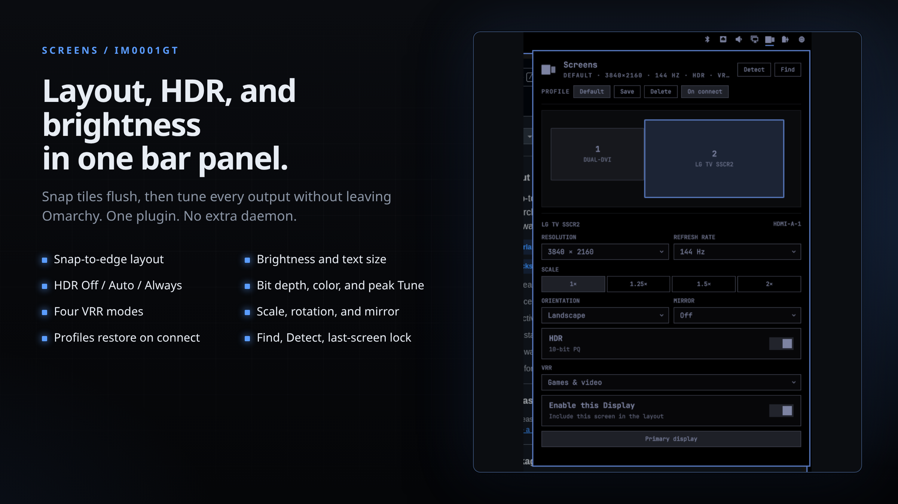

# Screens

An Omarchy bar widget for multi-monitor desks.

Click the two-tile icon for a Power-style panel that stays open. Displays are drawn at their real layout size. Drag them and they **snap flush** — no overlapping tiles, no mystery gaps that eat the cursor. Then set refresh, HDR, VRR, scale, rotation, and mirroring on the selected screen. Save the whole desk as a **profile**; Screens can restore it when a display is plugged in.

The stock **Display** widget stays where it is (brightness, text size). Screens uses a two-tile mark so the two icons never collide.

<p align="center">
  
</p>

| Click | Drag | Per screen | Profiles |
| --- | --- | --- | --- |
| Open the panel | Snap tiles to each other's edges | Resolution, Hz, HDR, VRR, scale, rotation, mirror, on/off | Save a desk, restore it on hotplug |

Works with two screens or a full battlestation. A fallback Hyprland rule still catches anything you hot-plug later.

## Why this exists

Omarchy's built-in Display panel does not arrange monitors or expose HDMI 2.1 features. Other marketplace tools either reuse the stock monitor glyph and skip snap, or wrap an external TUI (hyprmoncfg) so the bar only launches a daemon.

Screens keeps the editor in the panel: snap, Hz, HDR, VRR, and named profiles that follow make/model/serial when a display is plugged in. No AUR package, no extra daemon.

## Install

Plugins run as unsandboxed code inside `omarchy-shell`. Only add repos you trust.

```bash
omarchy plugin add https://github.com/IM0001GT/omarchy-screens --enable
```

That clones into `~/.config/omarchy/plugins/im0001gt.screens/` and can drop the widget on the right side of the bar, next to Display.

### One-shot from a clone

```bash
git clone https://github.com/IM0001GT/omarchy-screens.git
cd omarchy-screens
./install.sh
```

## Use

- **Click** the two-tile icon — panel stays open until you click away
- **Drag** a tile — edges snap to neighboring screens
- **Find** — flash a label so you know which rectangle is which
- Pick a screen, then set **resolution**, **refresh**, **HDR**, **VRR**, **scale**, **orientation**, or **mirror**
- **Save** / **Desk** / **Auto** at the top — compact profile chips. Auto restores the matching desk on hotplug
- Displays are labeled with Hyprland's model string. HDR / VRR disable themselves when the panel cannot do them
- Changes write `~/.config/hypr/monitors.lua` and reload Hyprland (backups and profiles land in `~/.local/state/im0001gt.screens/`)

Move it with `omarchy bar move im0001gt.screens`.

## Update

```bash
omarchy plugin update im0001gt.screens --yes
omarchy restart shell
```

## Uninstall

```bash
omarchy plugin remove im0001gt.screens
```

Your last `monitors.lua` stays in place. Backups are not deleted.

## Requirements

- [Omarchy](https://omarchy.org/) with the shell plugin CLI (`omarchy plugin add`)
- Hyprland 0.55+ Lua monitor config (`hl.monitor`)
- `python3` and `jq` (already on Omarchy)

HDR is 10-bit PQ (`cm = hdr`). Some capture tools do not like 10-bit. VRR modes are Off, Always, and Fullscreen — the same values Hyprland uses.

## Layout

```text
manifest.json          Omarchy plugin manifest (must live at repo root)
Screens.qml            Bar icon + click panel
ScreenMark.qml         Two-tile bar/hero mark
Model.js               Snap / normalize / mode helpers
scripts/display-ctl    hyprctl snapshot + monitors.lua writer
preview.png            Marketplace still
install.sh             Enable / place the widget
```

The repo root **is** the plugin. That is what `omarchy plugin add` and `omarchy plugin validate` expect.

## License

MIT. See [LICENSE](LICENSE).
